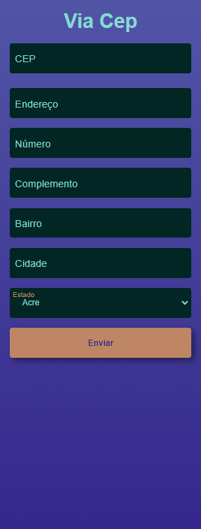
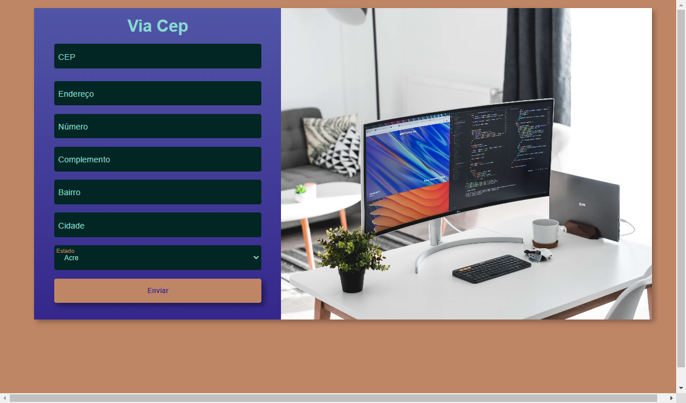

# projetos-aleatorios
Repositório para projetos aleatórios.
<ul>
    <li style="margin-bottom: 16px;">
        <a href="http://nicolas-felsi.github.io/projetos-aleatorios/imc-dom/" target="_blank" rel="noopener noreferrer">Calculadora IMC</a>
        
    </li>
    <li>
        <a href="http://nicolas-felsi.github.io/projetos-aleatorios/numero-aleatorio/" target="_blank" rel="noopener noreferrer">Jogo acertar número aleatório</a>
        
    </li>
    <li style="margin-top: 1rem;">
        <a style="display: block;" href="https://nicolas-felsi.github.io/projetos-aleatorios/form-cep/" target="_blank"rel="noopener noreferrer">Consumo da api ViaCep</a>
        
        
    </li>
</ul>

