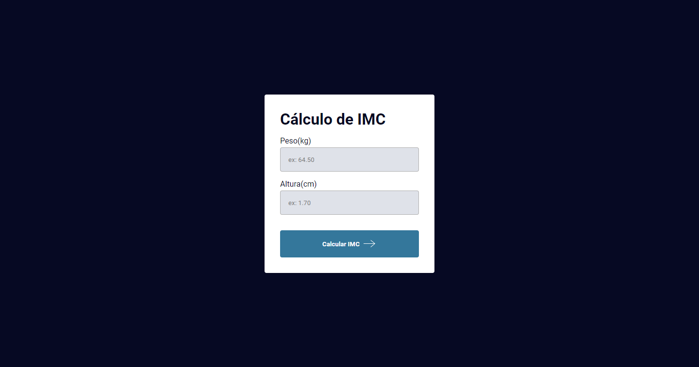

# projetos-aleatorios
Repositório para projetos aleatórios.
- [1º Calculadora IMC](https://nicolas-felsi.github.io/projetos-aleatorios/imc-dom/)
</img>
- [2º Jogo acertar número aleatório](https://nicolas-felsi.github.io/projetos-aleatorios/numero-aleatorio/)
</img>
