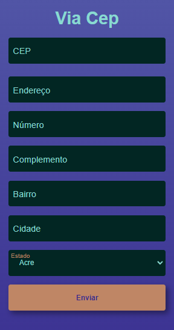

# projetos-aleatorios
Repositório para projetos aleatórios.
<u>
    <li style="margin-bottom: 16px; display: flex; flex-direction: column;">
        <a href="http://nicolas-felsi.github.io/projetos-aleatorios/imc-dom/" target="_blank" rel="noopener noreferrer">Calculadora IMC</a>
        
    </li>
    <li style="display: flex; flex-direction: column;">
        <a href="http://nicolas-felsi.github.io/projetos-aleatorios/numero-aleatorio/" target="_blank" rel="noopener noreferrer">Jogo acertar número aleatório</a>
        
    </li>
    <li style="display: flex; flex-direction: column;">
        <a href="https://nicolas-felsi.github.io/projetos-aleatorios/form-cep/" target="_blank" rel="noopener noreferrer">Consumo da api ViaCep</a>
        
        
    </li>
</u>

